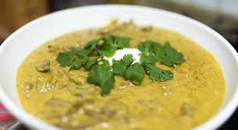

# odin-recipes
A simple recipe website.

This project challenges learners of HTML to create a simple recipe website.
By the end of this project, we will know how to set up our basic HTML
boilerplate and choose appropriate tags and attributes to organize web
content soundly.

##ATTRIBUTIONS

*Image by [Sam Schuno](https://www.flickr.com/photos/schuno/) licensed under [CC-BY-NC-SA 2.0](https://creativecommons.org/licenses/by-nc-sa/2.0/)
